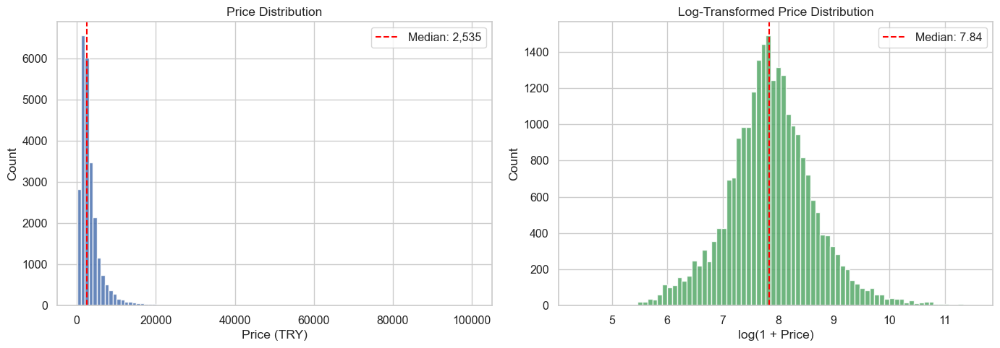
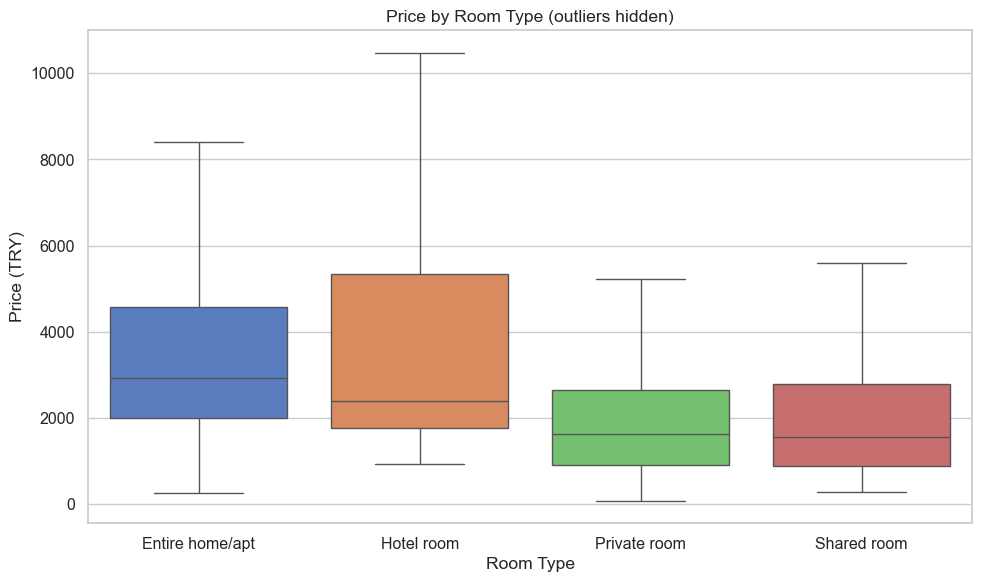
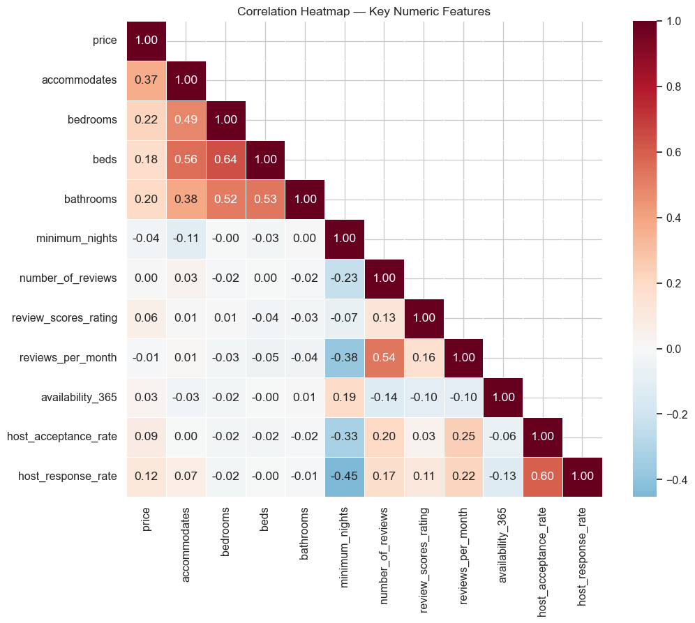
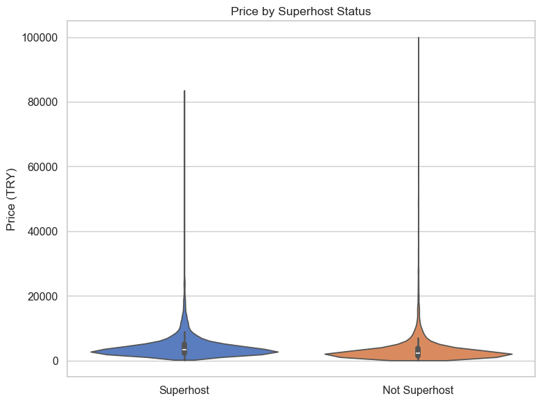
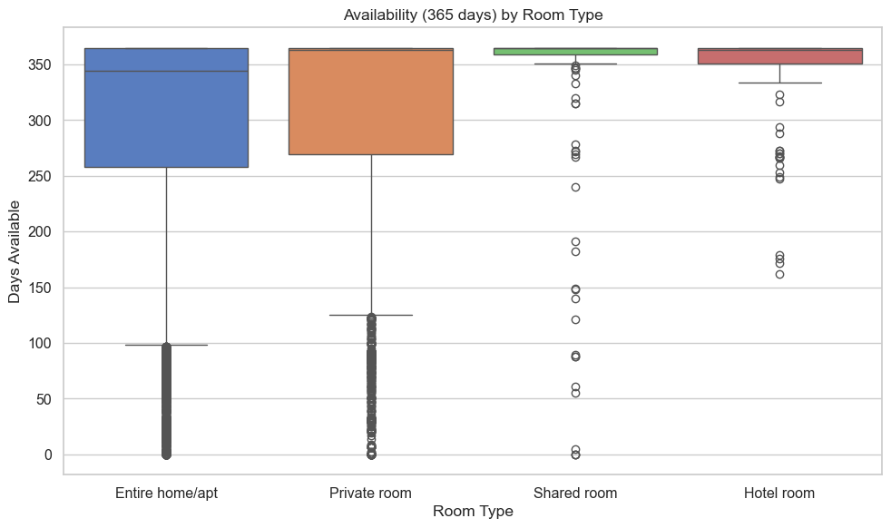

# Final Report - Istanbul Airbnb Analysis

**Course:** DSA 210 Introduction to Data Science - Spring 2025-2026  
**Student:** Elif Ince  
**Project:** Istanbul Airbnb Analysis  

## Motivation

Istanbul is one of Turkey's most visited cities and has a large short-term rental market. Airbnb prices in the city can vary substantially depending on location, room type, host characteristics, listing capacity, reviews, and availability. This project studies which listing features are most strongly associated with Airbnb prices in Istanbul and whether these patterns can be used to predict listing price.

The main research question is:

**Which features of an Airbnb listing are most strongly associated with its price in Istanbul?**

Supporting questions:

- How do room type, neighbourhood, and host status relate to price?
- How do room type and host characteristics relate to availability patterns?
- Are review-related signals associated with higher listing prices?
- How well can course-aligned machine learning models predict price?

## Data Source And Collection

The project uses the public [Inside Airbnb](http://insideairbnb.com/get-the-data/) Istanbul snapshot dated **September 29, 2025**. The data were collected using `src/download_data.py`, which downloads four files:

- `listings.csv.gz`: detailed listing-level information
- `calendar.csv.gz`: daily availability records
- `reviews.csv.gz`: individual review records
- `neighbourhoods.csv`: neighbourhood reference data

The project uses a public dataset, but it is enriched by combining multiple related Inside Airbnb files. Calendar information and review history are aggregated to the listing level and merged with the main listings file.

## Data Preparation

The preprocessing pipeline is implemented in `src/preprocess.py`. It creates a cleaned listing-level dataset at `data/processed/listings_enriched.csv`.

Main preprocessing steps:

- cleaned price strings and converted them to numeric TRY values,
- converted boolean and percentage columns to usable numeric or boolean types,
- extracted numeric bathroom counts from `bathrooms_text`,
- aggregated calendar data to listing level,
- aggregated review records into review count, first review, last review, review span, and review frequency features,
- audited the neighbourhood reference file,
- removed rows with missing, zero, or invalid prices,
- removed extreme price outliers above 100,000 TRY,
- dropped columns with more than 80% missing values.

After preprocessing, the final analysis dataset contains **25,206 listings** and **81 features**.

## Exploratory Data Analysis

The EDA was completed in `notebooks/02_eda_hypothesis_tests.ipynb` and summarized in `reports/phase3_eda_hypothesis_tests.md`.

Key descriptive findings:

- The mean listing price is **3,691 TRY** and the median is **2,535 TRY**.
- Price is strongly right-skewed, so medians and log-scale visualizations are more informative than the raw mean alone.
- Entire home/apt listings make up about **71.6%** of the dataset.
- Entire home/apt listings have the highest median price, while private rooms and shared rooms are cheaper.
- Listings are concentrated in a small number of central neighbourhoods, especially Beyoglu, Fatih, and Sisli.
- Structural capacity variables such as `accommodates`, `bedrooms`, `bathrooms`, and `beds` are positively related to price.







## Hypothesis Testing

The project tested five course-aligned hypotheses. Because price is highly skewed, non-parametric methods were used when normality assumptions were not appropriate.

| # | Research Question | Test | Result | Interpretation |
|---|-------------------|------|--------|----------------|
| 1 | Does price differ across room types? | Kruskal-Wallis | `H = 3584.86`, `p < 0.001`, `eta^2 = 0.142` | Room type is strongly associated with price. |
| 2 | Do superhosts differ from non-superhosts in price? | Mann-Whitney U | `U = 66,566,509.5`, `p < 0.001` | Superhost listings have higher median prices. |
| 3 | Is price associated with review score rating? | Spearman correlation | `rho = 0.148`, `p < 0.001` | The relationship is positive but weak. |
| 4 | Is availability level associated with room type? | Chi-square test | `chi^2 = 190.16`, `p < 0.001`, `Cramer's V = 0.061` | The association exists but is small. |
| 5 | Do prices differ across major neighbourhoods? | Kruskal-Wallis | `H = 625.57`, `p < 0.001`, `eta^2 = 0.030` | Prices differ across major neighbourhood groups. |





## Machine Learning Methods

The machine learning stage was completed in `notebooks/03_modeling.ipynb` and summarized in `reports/phase4_machine_learning.md`.

The prediction task was:

- **Target:** `price`
- **Task type:** regression
- **Scale:** original TRY scale for final reporting

Because price is strongly right-skewed, models were trained on `log(1 + price)` and predictions were transformed back to TRY for evaluation.

Models compared:

- Ridge Regression
- k-Nearest Neighbors Regressor
- Decision Tree Regressor
- Random Forest Regressor

Preprocessing was handled inside `scikit-learn` pipelines to reduce leakage:

- numeric features: median imputation,
- categorical features: most-frequent imputation and one-hot encoding,
- scaling for Ridge and kNN models.

## Model Results

| Model | CV RMSE | Test MAE | Test RMSE | Test R2 |
|------|--------:|---------:|----------:|--------:|
| Random Forest | 4,257.07 | 1,327.54 | **3,910.17** | **0.287** |
| kNN Regressor | 4,391.55 | 1,460.78 | 3,956.62 | 0.270 |
| Ridge Regression | 5,696.35 | 1,592.39 | 4,152.75 | 0.196 |
| Decision Tree | 4,392.99 | 1,587.21 | 4,254.12 | 0.156 |

The **Random Forest** model performed best on the held-out test set. The kNN model was close behind, while the Ridge baseline was weaker, suggesting that the relationship between listing features and price is not fully captured by a simple linear model.


The strongest predictive signals in the Random Forest model include `accommodates`, property type, longitude, bathrooms, latitude, host response rate, and bedrooms. These are consistent with the EDA results: size, property form, and location are among the most important price-related signals.

## Key Findings

The main findings of the project are:

- Room type is one of the strongest price-related features.
- Entire home/apt listings have higher median prices than private or shared rooms.
- Superhost listings are associated with higher prices.
- Location matters: prices differ significantly across major Istanbul neighbourhoods.
- Review score rating is statistically associated with price, but the practical relationship is weak.
- Availability patterns differ by room type, but the effect size is small.
- Random Forest produced the best predictive performance, but the overall R2 remains moderate.

## Limitations

This project has several limitations:

- The analysis is observational and supports association, not causation.
- The data represent a single Inside Airbnb snapshot from September 29, 2025.
- Some review-related variables have missing values because many listings have limited or no review history.
- Calendar price information was not useful enough in this snapshot to become a strong pricing feature.
- Text fields such as descriptions and amenities were excluded from the machine learning stage to keep the workflow aligned with course scope.
- The best model's R2 is about 0.287, so many price differences remain unexplained.

## Future Work

Future versions of the project could:

- compare multiple Istanbul snapshots to study price changes over time,
- add text features from listing descriptions and amenities,
- include neighbourhood-level external data such as transit access or tourism density,
- build stronger geospatial features from latitude and longitude,
- tune model hyperparameters more extensively,
- test additional models such as gradient boosting.

## Reproducibility

The repository includes scripts and notebooks needed to reproduce the analysis. Raw and processed CSV files are excluded from version control because of size, but they can be recreated.

Run:

```bash
pip install -r requirements.txt
python src/download_data.py
python src/preprocess.py
python src/create_notebook.py
python src/train_price_models.py
python src/create_modeling_notebook.py
jupyter nbconvert --to notebook --execute notebooks/02_eda_hypothesis_tests.ipynb --inplace
jupyter nbconvert --to notebook --execute notebooks/03_modeling.ipynb --inplace
```

## AI Usage Disclosure

AI tools were used to support project planning, repository organization, code review, documentation drafting, and final editing. The use of AI is documented separately in `AI_USAGE.md`. Final project decisions, result interpretation, and submission responsibility remain mine.

## References

- Inside Airbnb. Istanbul data snapshot, September 29, 2025. <http://insideairbnb.com/get-the-data/>
- DSA 210 Introduction to Data Science course project guidelines, Spring 2025-2026.
