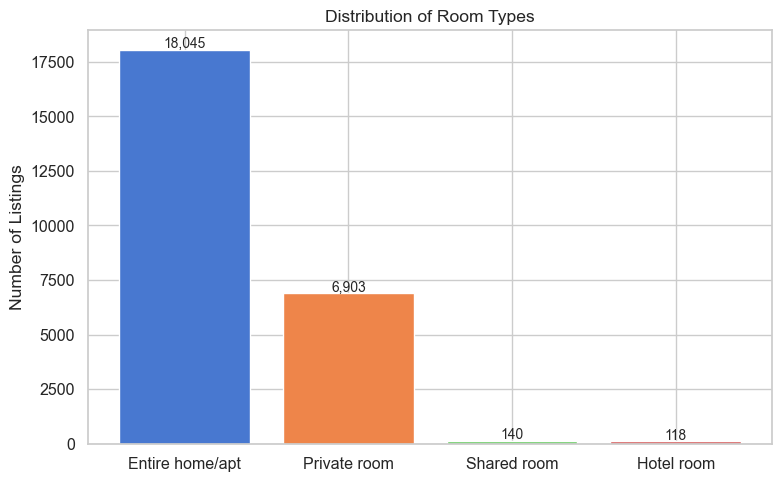
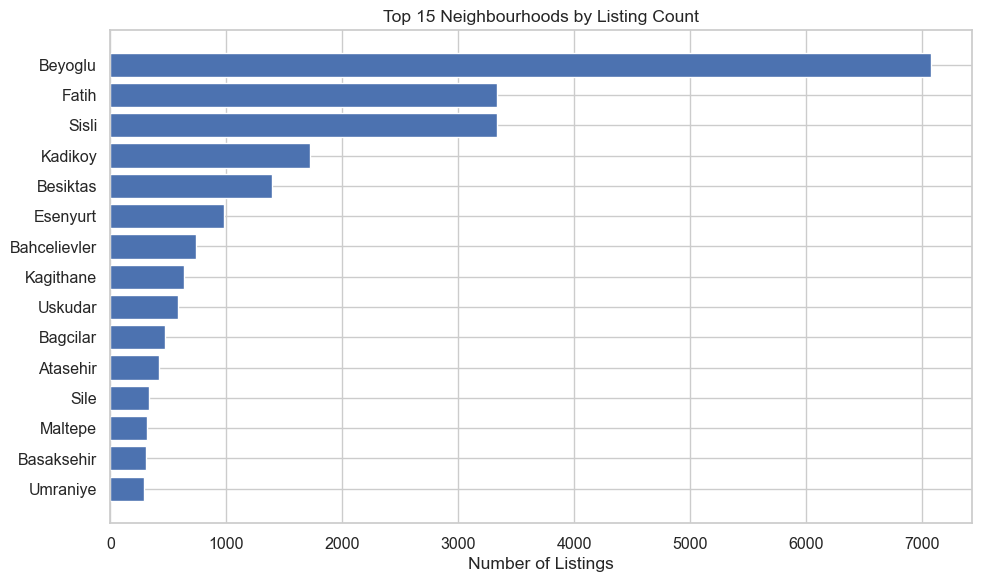
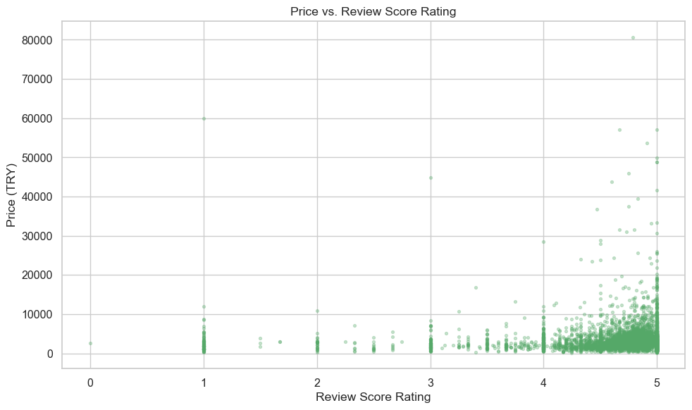

# Phase 3 Report - Data Collection, EDA, and Hypothesis Tests

**Course:** DSA 210 Introduction to Data Science - Spring 2025-2026  
**Student:** Elif Ince  
**Milestone:** April 14, 2026

## Objective

This report documents the completion of the Phase 3 milestone of the Istanbul Airbnb project. The goal of this stage was to:

1. collect the raw Inside Airbnb Istanbul data,
2. clean and combine the relevant files into an analysis-ready dataset,
3. perform exploratory data analysis,
4. and test the main project hypotheses with course-aligned statistical methods.

## Data Collection and Preparation

The raw data were downloaded from the [Inside Airbnb](http://insideairbnb.com/get-the-data/) Istanbul snapshot dated **September 29, 2025**. Four files were collected:

- `listings.csv.gz`
- `calendar.csv.gz`
- `reviews.csv.gz`
- `neighbourhoods.csv`

The final analysis dataset was built at the listing level. Calendar data were aggregated to the listing level, and review history was summarized through computed review count and review frequency features. The neighbourhood reference file was audited as part of data collection, but the listing file already contained the neighbourhood labels used in the final analysis.

After preprocessing:

- the final dataset contains **25,206 listings**,
- the cleaned dataset contains **81 features**,
- listings with missing or invalid prices were removed,
- extreme prices above **100,000 TRY** were excluded.

### Missing Data Handling

Since the dataset combines listing, calendar, and review information, missingness was handled differently depending on the role of each variable rather than with a single blanket rule.

- **Target variable (`price`)**: listings with missing or non-positive prices were removed because price is the main analysis variable and those rows cannot support the later analysis stages.
- **Very sparse columns**: columns with more than **80% missing values** were dropped entirely. This removed a small set of variables that were too incomplete to interpret reliably.
- **Partially missing numeric and review-related variables**: these were kept in the dataset when the missingness was still moderate, because dropping all such rows would have removed too many listings and reduced coverage unnecessarily.
- **Review-derived variables**: listings with no review history naturally remain missing on review-score and review-frequency fields. These were left as missing values rather than filled with artificial values, since “no reviews yet” is substantively different from a true zero rating.
- **Calendar-derived variables**: the calendar price field was too incomplete in this snapshot to be useful as a strong feature, so the calendar stage was used mainly for listing-level aggregation rather than aggressive imputation.

This approach kept the cleaning methodology transparent: drop rows only when the missingness breaks the main analysis target, drop columns only when they are overwhelmingly incomplete, and otherwise preserve the observed data structure for EDA and hypothesis testing.

## Dataset Snapshot

Key summary statistics:

- Mean price: **3,691 TRY**
- Median price: **2,535 TRY**
- Most common room type: **Entire home/apt** (**71.6%** of listings)
- Share of superhost listings: **20.7%**

Top 5 neighbourhoods by listing count:

1. Beyoglu - 7,079 listings
2. Fatih - 3,333 listings
3. Sisli - 3,333 listings
4. Kadikoy - 1,719 listings
5. Besiktas - 1,396 listings

## Exploratory Data Analysis

The EDA confirmed several strong patterns in the Istanbul Airbnb market:

- Price is strongly right-skewed, so the distribution is better interpreted through medians and log-transformed visuals than through the raw mean alone.
- Entire home/apt listings have the highest median prices, while private rooms and shared rooms are much cheaper.
- Listings are concentrated in a few major neighbourhoods, especially Beyoglu, Fatih, and Sisli.
- Larger listings tend to be more expensive: `accommodates`, `bedrooms`, `bathrooms`, and `beds` all show positive correlations with price.
- Review score rating has only a weak positive association with price.
- Availability patterns differ across room types, with hotel rooms and private rooms showing very high annual availability.

### Visual Evidence From EDA

The price distribution is heavily right-skewed, which is why the later hypothesis tests rely mostly on non-parametric methods and why the modeling stage uses a log-transformed target.

Entire home/apt listings dominate the Istanbul Airbnb market in this snapshot, so room type is an important grouping variable for both EDA and hypothesis testing.

The room-type comparison shows a clear price gap: entire home/apt listings have much higher median prices than private rooms and shared rooms.

Listings are concentrated in a small number of central neighbourhoods, especially Beyoglu, Fatih, and Sisli.

The correlation heatmap shows that structural capacity variables such as `accommodates`, `bedrooms`, `beds`, and `bathrooms` are more strongly related to price than review-score variables.

## Hypothesis Tests

All tests were selected to stay aligned with the statistical methods covered in the course. Since Airbnb price is highly skewed, non-parametric methods were used whenever normality assumptions were clearly violated.

| # | Research Question | Test | Result | Interpretation |
|---|-------------------|------|--------|----------------|
| 1 | Does price differ across room types? | Kruskal-Wallis | `H = 3584.86`, `p < 0.001`, `eta^2 = 0.142` | Strong evidence that at least one room type has a different price distribution. Entire home/apt has the highest median price. |
| 2 | Do superhosts differ from non-superhosts in price? | Mann-Whitney U | `U = 66,566,509.5`, `p < 0.001` | Superhost listings have significantly higher prices than non-superhost listings. Median price is **3,380 TRY** vs **2,355 TRY**. |
| 3 | Is listing price associated with review score rating? | Spearman correlation | `rho = 0.148`, `p < 0.001` | There is a statistically significant but weak positive association between review score rating and price. |
| 4 | Is availability level associated with room type? | Chi-square test of independence | `chi^2 = 190.16`, `p < 0.001`, `Cramer's V = 0.061` | Room type and availability level are associated, but the effect size is small. |
| 5 | Do prices differ across major Istanbul neighbourhoods? | Kruskal-Wallis | `H = 625.57`, `p < 0.001`, `eta^2 = 0.030` | Prices differ significantly across major neighbourhood groups. |

### Visual Support For Hypothesis Tests

Superhost listings have a visibly higher median price than non-superhost listings, matching the significant Mann-Whitney U test result.

The review-score relationship is positive but weak, which is consistent with the small Spearman correlation.

Availability patterns differ by room type, although the effect size remains small.

## Interpretation of Findings

The hypothesis tests support the main direction of the project:

- **Room type matters strongly for price.** This is one of the clearest signals in the dataset.
- **Superhost status is associated with higher prices.** This may reflect stronger host reputation, better listing quality, or better locations.
- **Neighbourhood differences are real and substantial.** Location remains a core explanatory factor in Istanbul Airbnb pricing.
- **Review score rating matters, but weakly.** It is statistically related to price, but much less strongly than structural listing features such as room type or capacity.
- **Availability differs by room type.** However, the practical strength of that relationship is modest.

## Limitations

- The analysis is observational and supports **associational**, not causal, conclusions.
- The data represent a single Inside Airbnb snapshot, so the findings may change over time.
- Some potentially useful variables still have substantial missingness even after dropping the sparsest columns, especially review-related variables for listings with little or no review history.
- Calendar price information in this snapshot was not useful enough to contribute a strong new pricing feature.
- The processed dataset intentionally excludes extreme price outliers above 100,000 TRY to keep the analysis interpretable.

## Next Step

The next milestone of the project will use this cleaned and analyzed dataset for machine learning models that predict listing price and compare interpretable baselines with stronger tree-based models.
