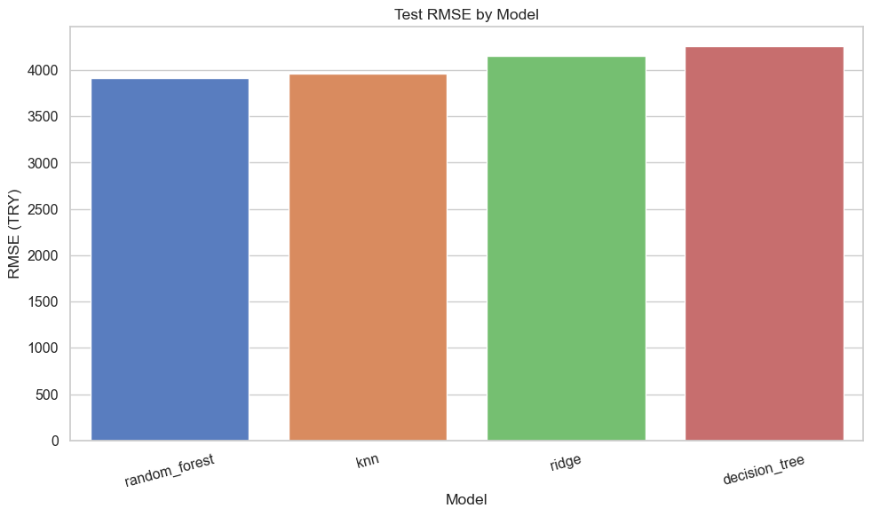
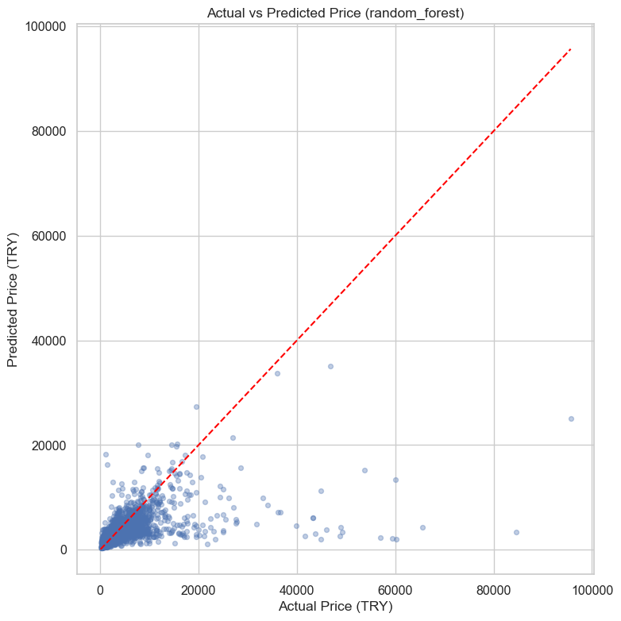
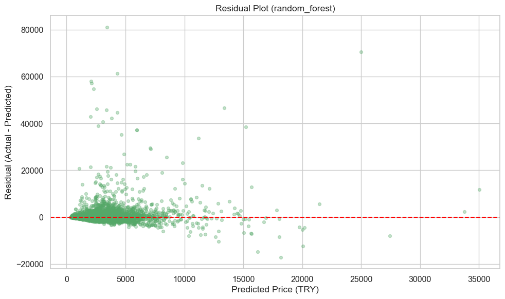
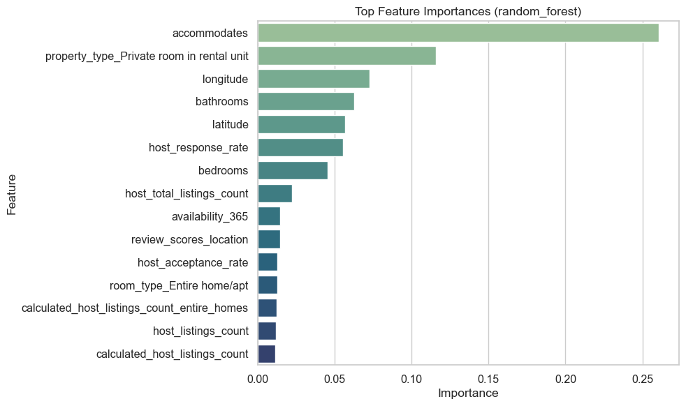

# Phase 4 Report - Machine Learning Methods

**Course:** DSA 210 Introduction to Data Science - Spring 2025-2026  
**Student:** Elif Ince  
**Milestone:** May 5, 2026

## Objective

This report documents the machine learning stage of the Istanbul Airbnb project. The goal of this milestone was to apply course-aligned supervised learning methods to the cleaned listing-level dataset and compare how well different model families predict listing price.

The machine learning task was kept intentionally focused:

- **Prediction target:** `price`
- **Task type:** regression
- **Output scale for reporting:** Turkish lira (TRY)

Because listing price is strongly right-skewed, the models were trained on `log(1 + price)` and then converted back to the original TRY scale for evaluation.

## Dataset And Preprocessing

The modeling stage uses the enriched dataset created in Phase 3:

- **Rows:** 25,206 listings
- **Columns:** 81 original variables before feature filtering

To keep the workflow reproducible and avoid data leakage, preprocessing was handled inside `scikit-learn` pipelines.

### Included feature groups

- structural listing features such as `accommodates`, `bedrooms`, `beds`, and `bathrooms`
- host features such as response and acceptance rates
- review features such as score dimensions and review counts
- availability features
- location features such as latitude, longitude, neighbourhood, and room/property type

### Excluded feature groups

- identifiers and URLs (`id`, `host_id`, listing/host/image URLs)
- long text fields (`name`, `description`, `host_about`, `amenities`, etc.)
- raw date fields used for bookkeeping
- target-adjacent outcome features such as `estimated_revenue_l365d` and `estimated_occupancy_l365d`

### Pipeline steps

- Numeric features: median imputation
- Categorical features: most-frequent imputation + one-hot encoding
- Scaling: applied to the linear and kNN models

## Models Compared

The selected models were chosen to match the machine learning methods covered in class:

1. **Ridge Regression** - interpretable linear baseline
2. **k-Nearest Neighbors Regressor** - distance-based method
3. **Decision Tree Regressor** - single-tree model
4. **Random Forest Regressor** - ensemble tree model

## Evaluation Strategy

The dataset was split into training and test sets, and model comparison was done with cross-validation on the training split only. This follows the course model-evaluation guidance and keeps the test set untouched until final scoring.

Reported metrics:

- **MAE** (mean absolute error)
- **RMSE** (root mean squared error)
- **R²**

All final metrics below are reported on the original **TRY** price scale.

## Results

| Model | CV RMSE | Test MAE | Test RMSE | Test R² |
|------|--------:|---------:|----------:|--------:|
| Random Forest | 4,257.07 | 1,327.54 | **3,910.17** | **0.287** |
| kNN Regressor | 4,391.55 | 1,460.78 | 3,956.62 | 0.270 |
| Ridge Regression | 5,696.35 | 1,592.39 | 4,152.75 | 0.196 |
| Decision Tree | 4,392.99 | 1,587.21 | 4,254.12 | 0.156 |

### Model Comparison Visual

The visual comparison makes the same pattern clear as the table: Random Forest has the lowest test RMSE, while kNN is close behind and the Ridge baseline is weaker.

## Main Findings

- The **Random Forest** model performed best on the held-out test set.
- The **kNN regressor** was competitive and only slightly worse than Random Forest on RMSE.
- The **Ridge baseline** was clearly weaker, suggesting that price relationships in the dataset are not well captured by a simple linear model alone.
- The **Decision Tree** model was the weakest non-linear model, which is consistent with the idea that a single tree is less stable than an ensemble.

## Interpreting The Best Model

The Random Forest feature-importance ranking suggests that the strongest predictive signals include:

- `accommodates`
- `property_type_Private room in rental unit`
- `longitude`
- `bathrooms`
- `latitude`
- `host_response_rate`
- `bedrooms`

These are broadly consistent with the earlier EDA findings: listing size, property form, and location are among the most important drivers associated with price.

The Ridge baseline also highlighted several strong coefficients, especially certain property-type and neighbourhood indicators, but its overall predictive quality remained lower than the tree ensemble.

### Best Model Diagnostics

The actual-vs-predicted plot shows that the model captures the broad price pattern but still struggles with high-price listings.

The residual plot confirms that prediction errors are larger for some expensive listings, which is expected because Airbnb prices are highly right-skewed.

The feature-importance plot supports the interpretation that listing capacity, location, property type, bathrooms, and host response rate are among the most useful predictors.

## Limitations

- The predictive power is still moderate (`R² ≈ 0.287`), so price is only partially explained by the available variables.
- The analysis is based on a single Istanbul snapshot and may not generalize to other dates or markets.
- Text features were excluded in this milestone to keep the workflow aligned with the course scope and computationally manageable.
- The models support **prediction**, not causal inference.

## Files Added For This Milestone

- `src/modeling_utils.py`
- `src/train_price_models.py`
- `src/create_modeling_notebook.py`
- `notebooks/03_modeling.ipynb`
- `reports/phase4_machine_learning.md`

## Next Step

The final stage of the project will integrate the Phase 3 statistical analysis and the Phase 4 modeling results into the final project report, along with a concise discussion of limitations, reproducibility, and AI usage disclosure.
